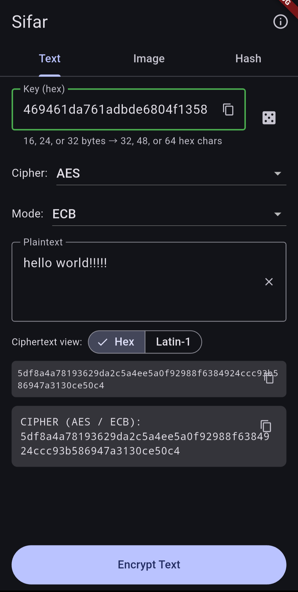
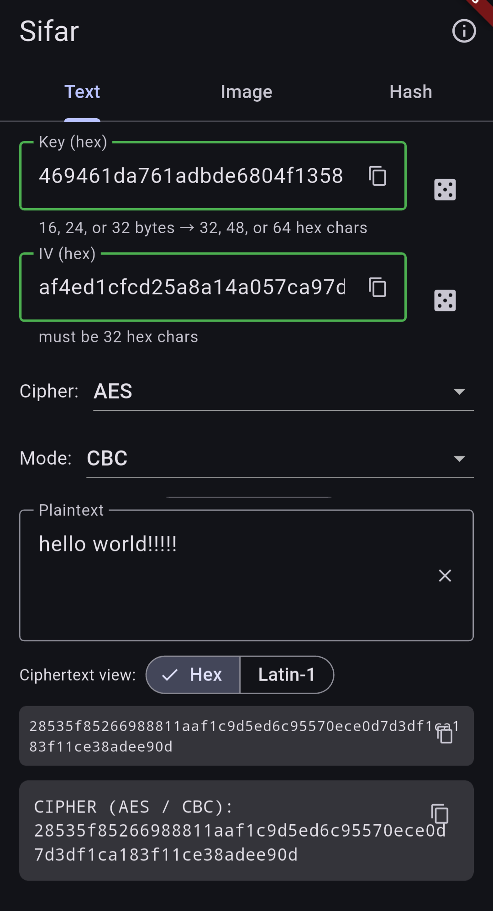
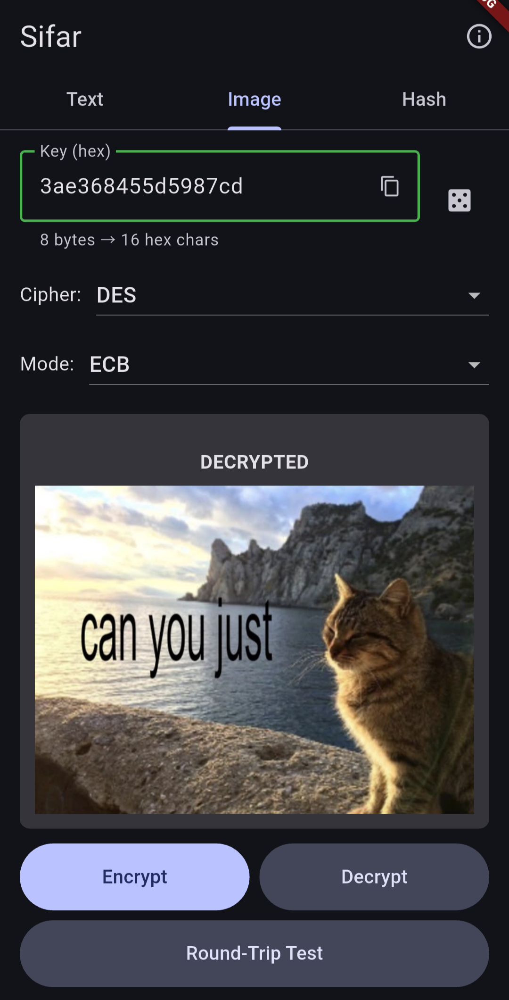
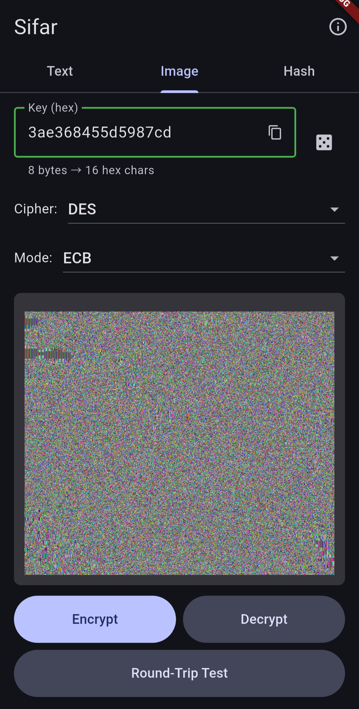
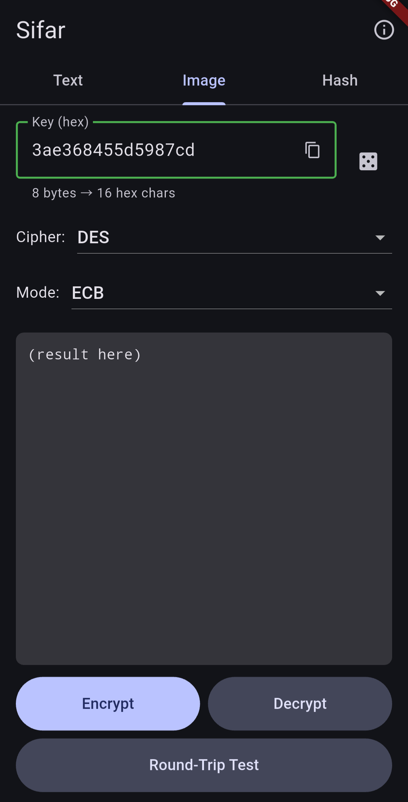
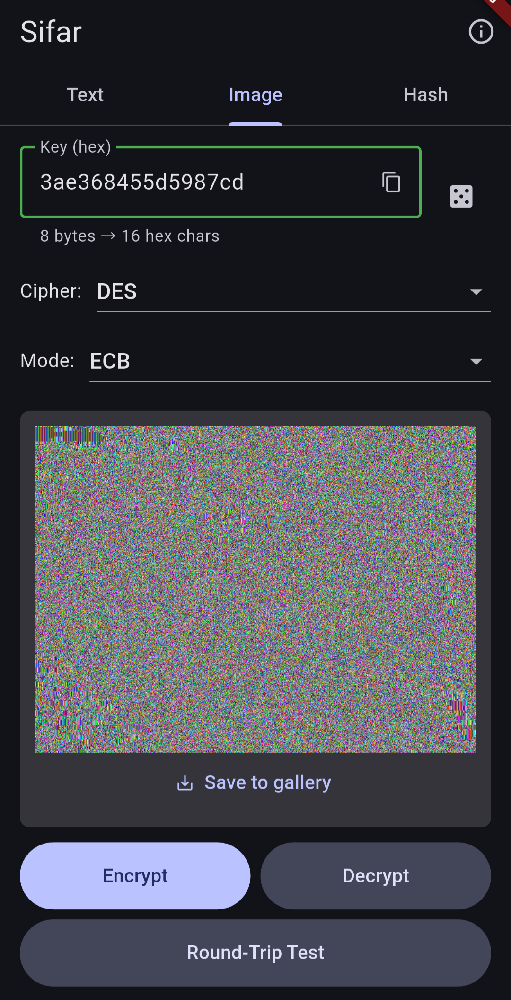
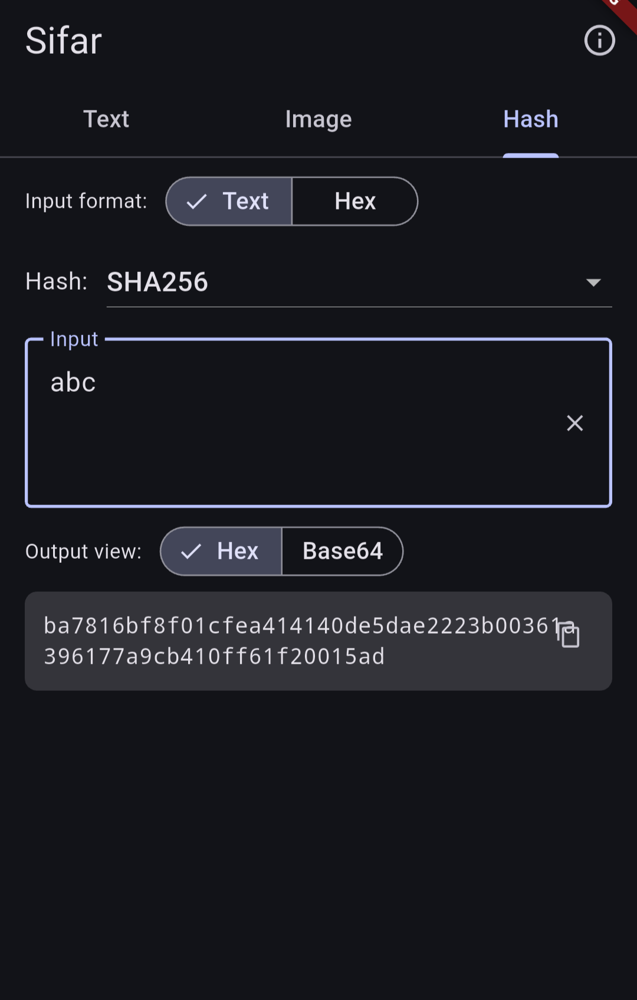
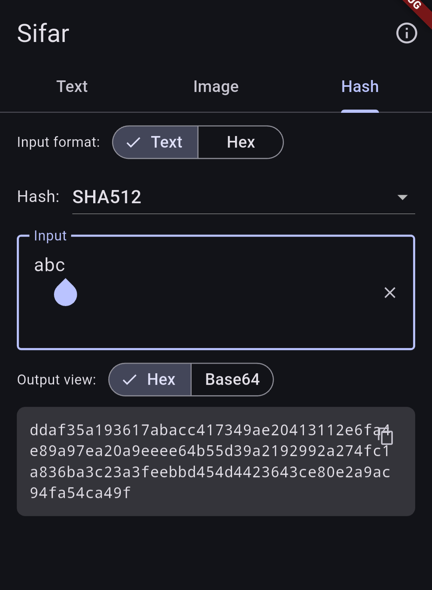

# Sifar — Flutter Android Demo

Android demo app for the [Sifar cryptography library](https://github.com/RamiBrahimi-c/cryptography-library) — a from-scratch C crypto implementation, called from Flutter via Dart FFI.

> ⚠️ **Not audited, not for production.** This is a learning project. Do not use it to protect anything that matters. Use libsodium, OpenSSL, or another vetted library for real work.

---

## What this is

This is one of the implementations of [sifar lib](https://github.com/RamiBrahimi-c/cryptography-library) - a lib that contains many classical, symmetric, asymmetric and hash ciphers, all in C from scratch .


Under the hood, this app exercises the Sifar C library through Dart FFI. Every cipher, mode, and hash is implemented from scratch in C — no OpenSSL, no libsodium, no third-party crypto. The C library is cross-compiled for Android by the NDK at build time, and called directly from Dart via `dart:ffi` — no platform channels, no JNI.

You can watch a text like "hello there!" turn into garbage bytes `c9213ad33dc3243b131d729a61ed3cab` or something like `É!:Ó=Ã$;ršaí<«` in *Latin-1*. **OR** you can just watch your image turn into complete noise and you can also get it back (*if you have your key, of course*) 

---
## Screenshots

<p align="center">
  
  
</p>

<p align="center">
  
  
</p>

<p align="center">
  
  


</p>


<p align="center">
  
  
</p>

---

## Features

**Symmetric ciphers:** AES, DES, 3DES, Blowfish, RC4, TEA, XTEA, Redpike

**Block cipher modes:** ECB, CBC, CFB, OFB, CTR

**Hashes:** MD4, MD5, SHA-256, SHA-512

**Operations:**
- Encrypt / decrypt text
- Encrypt / decrypt images (PNG via `stb_image`)
- Live preview of ciphertext and hashes
- Hex and Latin-1 view for ciphertext
- Hex, text, and base64 input/output formats
- Save encrypted/decrypted images to the phone's gallery
---

## Architecture

```
┌──────────────────────────────────┐
│  Flutter UI (Dart)               │
│  example/lib/main.dart           │
└──────────────┬───────────────────┘
               │  Dart wrappers
               ▼
┌──────────────────────────────────┐
│  SifarCipher / SifarHash /       │
│  SifarImage (lib/sifar.dart)     │
└──────────────┬───────────────────┘
               │  ffigen-generated bindings
               ▼
┌──────────────────────────────────┐
│  libmy_native_wrapper.so         │
│  (C, cross-compiled via NDK)     │
│  src/                            │
└──────────────┬───────────────────┘
               │
               ▼
┌──────────────────────────────────┐
│  Sifar C library                 │
│  (upstream repo)                 │
└──────────────────────────────────┘
```

The glue between Dart and C lives in `src/sifar_ffi.c` and `src/sifar_ffi.h`. These expose a small, uniform surface to Dart (mode dispatch, key allocation helpers, hash dispatch) while the underlying Sifar implementation stays clean.

FFI bindings are generated by [`ffigen`](https://pub.dev/packages/ffigen) from `src/sifar_ffi.h`. Configuration lives in `ffigen.yaml`. The C sources are compiled for Android by [`native_toolchain_c`](https://pub.dev/packages/native_toolchain_c) via `hook/build.dart`.

---

## Building

Requires Flutter (3.x+) and the Android SDK/NDK.

```bash
cd example
flutter pub get
flutter run
```

First build takes a few minutes (NDK downloads, Gradle setup). Subsequent builds are fast.

Release APK:

```bash
cd example
flutter build apk --release
```

---

## Testing

Dart-side tests run on the host (Linux/macOS/Windows) and cover the FFI bridge end-to-end:

```bash
flutter test
```

Covered:
- AES-128/192/256 against FIPS-197 known-answer vectors
- Round-trip encrypt → decrypt for all supported ciphers
- SHA-256 / SHA-512 against FIPS 180-4 vectors
- Block cipher mode round-trips (ECB/CBC/CFB/OFB/CTR)

---

## Project layout

```
my_native_wrapper/
├── src/                  C sources + FFI glue
│   ├── sifar_ffi.c/h     FFI surface exposed to Dart
│   ├── ciphers/          Cipher implementations
│   └── common/           Shared utilities
├── lib/
│   ├── sifar.dart        Dart wrappers (SifarCipher, SifarHash, SifarImage)
│   └── my_native_wrapper_bindings_generated.dart   ffigen output
├── hook/
│   └── build.dart        Native build hook (NDK cross-compile)
├── ffigen.yaml           ffigen config
├── test/                 Dart tests
└── example/              The Android app
    └── lib/
        ├── main.dart
        └── about_page.dart
```

---

## Related

- **Sifar C library** — https://github.com/RamiBrahimi-c/cryptography-library
- **ffigen** — https://pub.dev/packages/ffigen
- **native_toolchain_c** — https://pub.dev/packages/native_toolchain_c
- **Dart FFI docs** — https://dart.dev/interop/c-interop

---

## Disclaimer

This project is a demonstration and learning exercise. The underlying cryptographic implementations have not been audited and should not be used to protect sensitive data. If you need real cryptography, use a vetted library.

